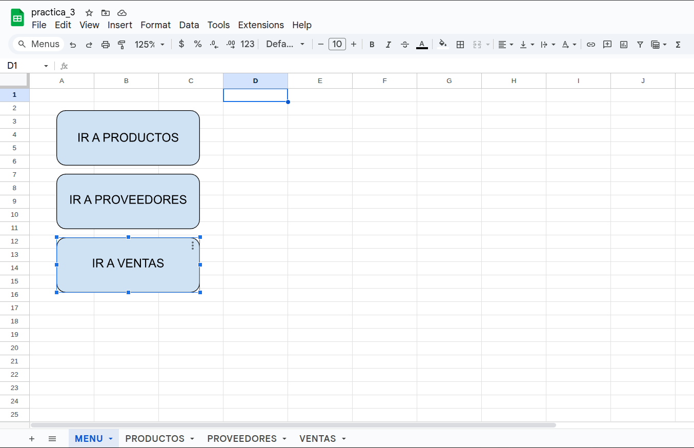
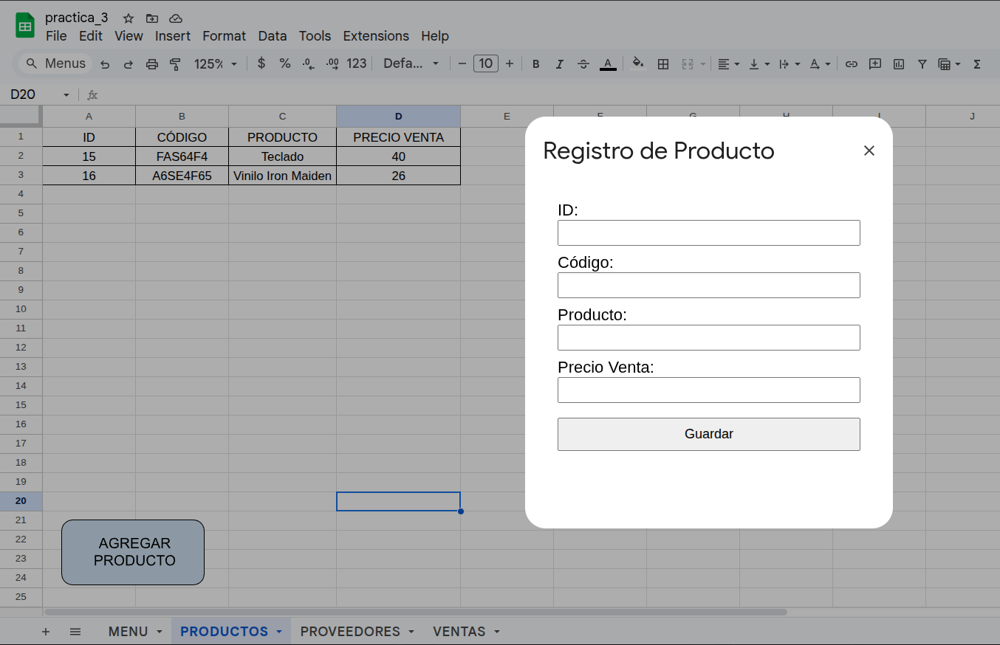

# Sistema de Registro de Productos en Google Sheets

Este proyecto implementa un sistema básico para la gestión de productos utilizando Google Sheets y Google Apps Script. Incluye una hoja de menú principal, navegación entre secciones y un formulario para registrar productos.

---

## 📌 Secciones del Proyecto

### 🗂️ MENÚ PRINCIPAL

La hoja `MENU` contiene tres botones que permiten la navegación entre las diferentes secciones del sistema:

- **Productos**
- **Proveedores**
- **Ventas**

Estos botones están vinculados a funciones de Google Apps Script que activan las respectivas hojas del documento.

📷 Captura:

---

### 📦 HOJA DE PRODUCTOS

En la hoja `PRODUCTOS` se encuentra una tabla con las siguientes columnas:

- `ID`
- `CÓDIGO`
- `PRODUCTO`
- `PRECIO VENTA`

Cada nuevo producto registrado se inserta automáticamente en esta tabla, centrado y con bordes visibles para una mejor presentación.

📷 Captura:

---

## ⚙️ Tecnologías Utilizadas

- Google Sheets
- Google Apps Script
- HTML / CSS / JavaScript

---

## ✅ Funcionalidades

- Navegación entre hojas usando botones.
- Formulario personalizado para registro de datos.
- Inserción automática con formato centrado y bordes.
- Uso de Apps Script para automatización y lógica del sistema.

---

## 📥 Cómo usar

1. Sube la hoja de cálculos a Google Sheets.
2. Abre el editor de Apps Script (`Extensiones > Apps Script`).
3. Crea dos archivos (`Code\.gs` y `FormularioProducto\.html`).
4. Copia el contenido de los archivos que se encuentran en la la carpeta `apps_scripts`, y guarda los cambios.
4. Asigna funciones a los botones según los nombres de las funciones del archivo `Code.gs`.
5. ¡Listo para usar!

---

